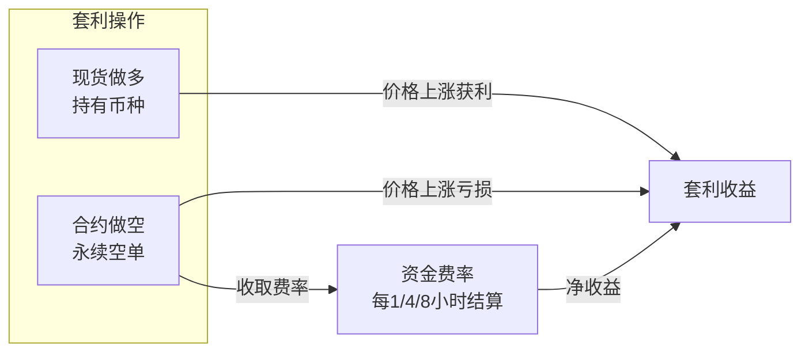
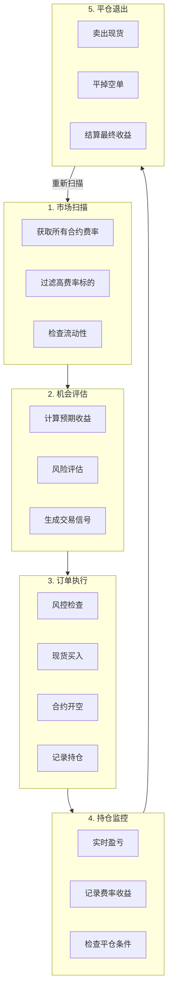
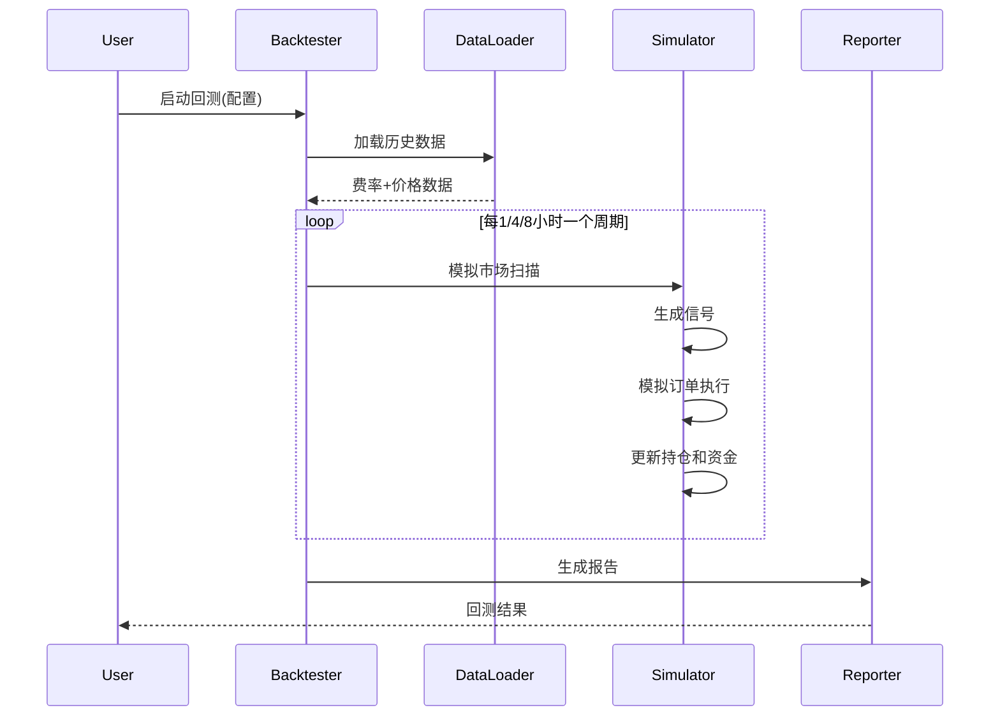
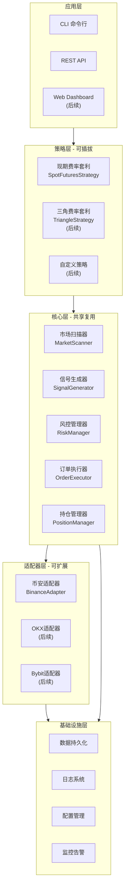
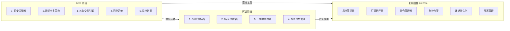

# 现货-期货费率套利系统 (Spot-Futures Funding Arbitrage)

## 一、系统概述

### 1.1 策略原理

现期费率套利是一种**市场中性策略**，当永续合约资金费率为正时（多头付给空头）：



**核心收益来源**：

- 现货多头与合约空头相互对冲价格波动
- 合约空头持续收取正资金费率（结算周期因标的而异：1小时/4小时/8小时）
- 年化收益 = 资金费率 × 每日结算次数 × 365天
  - 1小时周期：24次/天
  - 4小时周期：6次/天
  - 8小时周期：3次/天

### 1.2 MVP 范围定义

| 特性 | MVP | 后续迭代 |

|------|-----|----------|

| 交易所 | 币安 | OKX、Bybit |

| 策略 | 现期费率套利 | 三角套利 |

| 数据库 | SQLite | PostgreSQL |

| 界面 | CLI + REST API | Web Dashboard |

| 告警 | 日志 + Webhook | 企业微信/Telegram Bot |

---

## 二、核心业务流程

### 2.1 整体流程图



### 2.2 详细业务规则

#### 2.2.1 标的筛选规则

**进入条件（全部满足）**：

- 资金费率 >= 开仓阈值（默认 0.05%，年化约 54%）
- 24小时成交量 >= 最小流动性要求（默认 $1,000,000）
- 现货和合约市场均可交易
- 现货-合约价差 <= 最大价差阈值（默认 0.5%）
- 历史费率稳定性检查（最近 N 次费率为正的比例 >= 80%）

**排除条件**：

- 即将下架的交易对
- 暂停交易的币种
- 近期有重大事件（分叉、迁移等）的币种

#### 2.2.2 开仓触发规则

```typescript
interface OpenSignalConditions {
  fundingRate: number;        // >= 0.05%
  expectedAnnualReturn: number; // >= 30%
  accountBalance: number;     // >= 所需资金
  currentPositions: number;   // < 最大持仓数
  symbolNotInCooldown: boolean; // 不在冷却期
}
```

**开仓流程**：

1. 检查账户余额是否充足
2. 计算开仓数量（基于风控规则）
3. 同时下单：现货限价买入 + 合约限价开空
4. 等待成交（超时取消重试）
5. 确保双边数量一致
6. 记录持仓信息

#### 2.2.3 平仓触发规则

| 触发条件 | 阈值 | 优先级 |

|---------|------|-------|

| **止损** | 亏损 >= 2% | 最高 |

| **价差异常** | 价差 >= 1% | 高 |

| **止盈** | 收益 >= 5% | 中 |

| **费率下降** | 费率 < 0.01% | 中 |

| **持仓超时** | 持仓 > 30天 | 低 |

#### 2.2.4 资金费率结算

**结算周期**（因标的而异）：

- **8小时周期**：00:00、08:00、16:00 UTC（主流币种如 BTC、ETH）
- **4小时周期**：00:00、04:00、08:00、12:00、16:00、20:00 UTC
- **1小时周期**：每小时整点结算

**结算信息获取**：

- 通过 `/fapi/v1/premiumIndex` 接口获取 `nextFundingTime`（下次结算时间）
- 通过 `/fapi/v1/fundingRate` 接口获取历史结算记录

**结算记录**：

```typescript
interface FundingRecord {
  positionId: string;
  symbol: string;
  fundingRate: number;
  fundingInterval: number;      // 结算周期（小时）：1 | 4 | 8
  nextFundingTime: Date;        // 下次结算时间
  positionSize: number;
  fundingAmount: number;        // = positionSize × markPrice × fundingRate
  collectedAt: Date;
}
```

---

## 三、风险控制体系

### 3.1 仓位管理

```typescript
interface RiskLimits {
  maxPositionPct: 0.15;       // 单标的最大仓位占总资金 15%
  maxTotalExposurePct: 0.70;  // 总持仓不超过总资金 70%
  maxPositions: 5;            // 最多持有 5 个标的
  minPositionValue: 100;      // 最小持仓价值 $100
}
```

### 3.2 止损止盈

```typescript
interface PnLLimits {
  stopLossPct: -0.02;         // 单仓止损 -2%
  takeProfitPct: 0.05;        // 单仓止盈 +5%
  maxDrawdownPct: -0.10;      // 账户最大回撤 -10%
}
```

### 3.3 异常处理

| 异常场景 | 处理方式 |

|---------|---------|

| 订单部分成交 | 调整对手方数量匹配 |

| 单边成交 | 取消未成交方，平掉已成交方 |

| API 连接断开 | 指数退避重连，暂停新开仓 |

| 价差剧烈波动 | 触发紧急平仓 |

| 账户余额不足 | 暂停开仓，保留现有持仓 |

---

## 四、技术架构设计

### 4.1 技术栈

| 层级 | 技术选型 |

|------|---------|

| 语言 | TypeScript 5.x |

| 运行时 | Node.js 20 LTS |

| Web 框架 | Fastify |

| 数据库 | SQLite (better-sqlite3) / PostgreSQL (后续) |

| ORM | Drizzle ORM |

| 任务调度 | node-cron |

| WebSocket | ws |

| 日志 | pino |

| 配置管理 | dotenv + zod |

| 测试 | vitest |

### 4.2 目录结构

```
src/
├── adapters/              # 交易所适配器
│   ├── exchange.interface.ts
│   ├── binance/
│   │   ├── client.ts      # REST + WebSocket 客户端
│   │   ├── spot.ts        # 现货 API
│   │   ├── futures.ts     # 合约 API
│   │   └── types.ts
│   └── okx/               # 预留
│       └── index.ts
│
├── core/                  # 核心策略逻辑
│   ├── scanner.ts         # 市场扫描器
│   ├── evaluator.ts       # 机会评估器
│   ├── signal.ts          # 信号生成器
│   ├── executor.ts        # 订单执行器
│   └── position.ts        # 持仓管理器
│
├── risk/                  # 风险控制
│   ├── manager.ts         # 风控管理器
│   └── calculator.ts      # 风险计算
│
├── backtest/              # 回测模块
│   ├── engine.ts          # 回测引擎
│   ├── simulator.ts       # 交易模拟器
│   └── reporter.ts        # 报告生成
│
├── monitoring/            # 监控告警
│   ├── metrics.ts         # 指标收集
│   ├── alerter.ts         # 告警通知
│   └── dashboard.ts       # 仪表盘数据
│
├── db/                    # 数据持久化
│   ├── schema.ts          # 数据库 Schema
│   ├── migrations/        # 迁移文件
│   └── repository.ts      # 数据访问层
│
├── api/                   # REST API
│   ├── routes/
│   │   ├── positions.ts
│   │   ├── signals.ts
│   │   └── backtest.ts
│   └── server.ts
│
├── scheduler/             # 定时任务
│   ├── funding-check.ts   # 费率检查
│   └── position-monitor.ts
│
├── config/
│   ├── default.ts         # 默认配置
│   └── schema.ts          # 配置校验
│
├── utils/
│   ├── logger.ts
│   ├── retry.ts
│   └── decimal.ts
│
└── index.ts               # 入口
```

### 4.3 核心接口设计

**资金费率信息类型**：

```typescript
// src/types/market.ts
interface FundingRateInfo {
  symbol: string;
  fundingRate: Decimal;           // 当前费率
  fundingInterval: number;        // 结算周期（小时）：1 | 4 | 8
  nextFundingTime: Date;          // 下次结算时间
  markPrice: Decimal;             // 标记价格
  indexPrice: Decimal;            // 指数价格
  timestamp: Date;
}
```

**交易所适配器接口**（支持扩展多交易所）：

```typescript
// src/adapters/exchange.interface.ts
interface IExchangeAdapter {
  // 市场数据
  getFundingRates(symbols?: string[]): Promise<FundingRateInfo[]>;
  getFundingRateHistory(symbol: string, startTime: Date, endTime: Date): Promise<FundingRateInfo[]>;
  getOrderBook(symbol: string, marketType: MarketType): Promise<OrderBook>;
  get24hVolume(symbol: string, marketType: MarketType): Promise<Decimal>;
  
  // 交易操作
  placeOrder(params: OrderParams): Promise<Order>;
  cancelOrder(orderId: string, symbol: string, marketType: MarketType): Promise<boolean>;
  getOrderStatus(orderId: string, symbol: string, marketType: MarketType): Promise<Order>;
  
  // 账户信息
  getPositions(symbols?: string[]): Promise<Position[]>;
  getBalances(): Promise<Balance[]>;
  
  // WebSocket 订阅
  subscribeOrderBook(symbol: string, callback: (data: OrderBook) => void): void;
  subscribeFundingRate(callback: (data: FundingRateInfo) => void): void;
}
```

---

## 五、回测系统

### 5.1 回测流程



### 5.2 回测指标

| 指标 | 说明 |

|------|------|

| 总收益率 | (期末净值 - 初始资金) / 初始资金 |

| 年化收益率 | 总收益率 × (365 / 回测天数) |

| 夏普比率 | (年化收益 - 无风险利率) / 年化波动率 |

| 最大回撤 | 期间最大峰值到谷值的跌幅 |

| 胜率 | 盈利交易次数 / 总交易次数 |

| 盈亏比 | 平均盈利 / 平均亏损 |

| 平均持仓周期 | 所有持仓的平均持有天数 |

| 总收取费率 | 所有持仓收取的资金费率总和 |

### 5.3 回测配置

```typescript
interface BacktestConfig {
  startDate: Date;           // 回测开始日期
  endDate: Date;             // 回测结束日期
  initialCapital: number;    // 初始资金 (USDT)
  symbols?: string[];        // 指定标的，null 为全部
  commissionRate: number;    // 手续费率 (0.001 = 0.1%)
  slippagePct: number;       // 滑点估算 (0.0005 = 0.05%)
  strategyConfig: StrategyConfig; // 策略参数
}
```

---

## 六、监控与告警

### 6.1 监控指标

**系统指标**：

- API 调用成功率、延迟
- WebSocket 连接状态
- 任务执行状态

**业务指标**：

- 当前持仓数量和价值
- 未实现盈亏
- 已收取资金费率
- 账户余额和可用资金
- 当前高费率机会数量

### 6.2 告警规则

| 告警级别 | 触发条件 | 通知方式 |

|---------|---------|---------|

| CRITICAL | 账户余额异常、API 认证失败 | 即时推送 |

| ERROR | 订单执行失败、持仓异常 | 即时推送 |

| WARNING | 费率下降、价差扩大 | 汇总推送 |

| INFO | 开仓/平仓成功、费率结算 | 日报汇总 |

### 6.3 API 接口

```
GET  /api/v1/status           # 系统状态
GET  /api/v1/positions        # 当前持仓
GET  /api/v1/positions/:id    # 持仓详情
POST /api/v1/positions/:id/close  # 手动平仓
GET  /api/v1/opportunities    # 当前机会
GET  /api/v1/history          # 历史交易
GET  /api/v1/metrics          # 收益指标
POST /api/v1/backtest         # 运行回测
GET  /api/v1/config           # 获取配置
PUT  /api/v1/config           # 更新配置
```

---

## 七、关键币安 API 端点

### 7.1 现货 API

| 功能 | 端点 | 方法 |

|------|------|------|

| 交易对信息 | `/api/v3/exchangeInfo` | GET |

| 深度数据 | `/api/v3/depth` | GET |

| 最优买卖价 | `/api/v3/ticker/bookTicker` | GET |

| 下单 | `/api/v3/order` | POST |

| 查询订单 | `/api/v3/order` | GET |

| 账户信息 | `/api/v3/account` | GET |

### 7.2 合约 API (USDT 永续)

| 功能 | 端点 | 方法 | 关键字段 |

|------|------|------|---------|

| 资金费率 | `/fapi/v1/premiumIndex` | GET | `fundingRate`, `nextFundingTime` |

| 历史费率 | `/fapi/v1/fundingRate` | GET | `fundingRate`, `fundingTime` |

| 深度数据 | `/fapi/v1/depth` | GET | `bids`, `asks` |

| 下单 | `/fapi/v1/order` | POST | `symbol`, `side`, `quantity` |

| 持仓信息 | `/fapi/v2/positionRisk` | GET | `positionAmt`, `unRealizedProfit` |

| 账户信息 | `/fapi/v2/account` | GET | `totalWalletBalance`, `availableBalance` |

**注意**：`nextFundingTime` 字段可用于判断该标的的结算周期（1小时/4小时/8小时）

---

## 八、配置参数说明

```yaml
# config.yaml
exchange:
  name: binance
  testnet: false  # 是否使用测试网

strategy:
  scanner:
    minFundingRate: 0.0005       # 最小费率阈值 0.05%
    min24hVolume: 1000000        # 最小日成交量 $1M
    maxSpreadPct: 0.005          # 最大价差 0.5%
    fundingStabilityRatio: 0.8   # 费率稳定性要求 80%
  
  signals:
    openThreshold: 0.0005        # 开仓费率阈值
    closeThreshold: 0.0001       # 平仓费率阈值
    minAnnualReturn: 0.30        # 最小年化收益 30%
    cooldownHours: 24            # 冷却期 24 小时
  
  risk:
    maxPositionPct: 0.15         # 单仓最大比例 15%
    maxTotalExposurePct: 0.70    # 总仓位最大比例 70%
    maxPositions: 5              # 最大持仓数
    stopLossPct: 0.02            # 止损比例 2%
    takeProfitPct: 0.05          # 止盈比例 5%
  
  execution:
    orderTimeoutSeconds: 30      # 订单超时 30 秒
    maxSlippagePct: 0.001        # 最大滑点 0.1%
    useLimitOrders: true         # 使用限价单

monitoring:
  logLevel: info
  alertWebhook: ${ALERT_WEBHOOK_URL}
  metricsPort: 9090

database:
  type: sqlite
  path: ./data/arbitrage.db
```

---

## 九、扩展性设计（三角套利预留）

本系统采用**插件化架构**设计，MVP 阶段专注于币安现期费率套利，同时预留完整的扩展能力，以便后续无缝升级到三角合约费率套利。

### 9.1 整体架构分层



**架构原则**：

- **策略层**：不同套利策略作为独立模块，实现统一接口，可通过配置启用/禁用
- **核心层**：通用的交易逻辑，所有策略共享，约占代码量 40%
- **适配器层**：交易所 API 封装，统一接口，新增交易所只需实现接口
- **基础设施层**：日志、配置、数据库等，100% 复用

### 9.2 交易所适配器扩展设计

#### 9.2.1 统一接口定义

```typescript
// src/adapters/exchange.interface.ts

/** 交易所类型枚举 */
export enum ExchangeType {
  BINANCE = 'binance',
  OKX = 'okx',
  BYBIT = 'bybit',
}

/** 市场类型 */
export enum MarketType {
  SPOT = 'spot',
  FUTURES = 'futures',  // USDT 永续
  SWAP = 'swap',        // 币本位永续
}

/** 交易所适配器接口 - 所有交易所必须实现 */
export interface IExchangeAdapter {
  /** 交易所标识 */
  readonly exchangeType: ExchangeType;
  
  /** 连接状态 */
  isConnected(): boolean;
  
  // ========== 市场数据 ==========
  
  /** 获取所有合约的实时资金费率（包含结算周期信息） */
  getFundingRates(symbols?: string[]): Promise<FundingRateInfo[]>;
  
  /** 获取历史资金费率（用于回测） */
  getFundingRateHistory(
    symbol: string, 
    startTime: Date, 
    endTime: Date
  ): Promise<FundingRateInfo[]>;
  
  /** 获取订单簿深度 */
  getOrderBook(symbol: string, marketType: MarketType): Promise<OrderBook>;
  
  /** 获取 24 小时成交量 */
  get24hVolume(symbol: string, marketType: MarketType): Promise<Decimal>;
  
  /** 获取交易对信息（精度、最小数量等） */
  getSymbolInfo(symbol: string, marketType: MarketType): Promise<SymbolInfo>;
  
  // ========== 交易操作 ==========
  
  /** 下单 */
  placeOrder(params: OrderParams): Promise<Order>;
  
  /** 取消订单 */
  cancelOrder(
    orderId: string, 
    symbol: string, 
    marketType: MarketType
  ): Promise<boolean>;
  
  /** 查询订单状态 */
  getOrderStatus(
    orderId: string, 
    symbol: string, 
    marketType: MarketType
  ): Promise<Order>;
  
  // ========== 账户信息 ==========
  
  /** 获取合约持仓 */
  getPositions(symbols?: string[]): Promise<Position[]>;
  
  /** 获取账户余额 */
  getBalances(): Promise<Balance[]>;
  
  /** 获取账户总权益 */
  getTotalEquity(): Promise<Decimal>;
  
  // ========== WebSocket 实时订阅 ==========
  
  /** 订阅订单簿更新 */
  subscribeOrderBook(
    symbol: string, 
    marketType: MarketType,
    callback: (data: OrderBook) => void
  ): () => void;  // 返回取消订阅函数
  
  /** 订阅资金费率更新 */
  subscribeFundingRate(
    callback: (data: FundingRateInfo) => void
  ): () => void;
  
  /** 订阅订单状态更新 */
  subscribeOrderUpdate(
    callback: (data: Order) => void
  ): () => void;
}
```

#### 9.2.2 适配器工厂模式

```typescript
// src/adapters/factory.ts

import { BinanceAdapter } from './binance';
import { OkxAdapter } from './okx';       // 后续实现
import { BybitAdapter } from './bybit';   // 后续实现

/** 适配器工厂 - 根据配置创建对应的交易所适配器 */
export class ExchangeAdapterFactory {
  private static adapters: Map<ExchangeType, IExchangeAdapter> = new Map();
  
  /** 获取或创建适配器实例（单例） */
  static getAdapter(type: ExchangeType, config: ExchangeConfig): IExchangeAdapter {
    if (!this.adapters.has(type)) {
      const adapter = this.createAdapter(type, config);
      this.adapters.set(type, adapter);
    }
    return this.adapters.get(type)!;
  }
  
  private static createAdapter(
    type: ExchangeType, 
    config: ExchangeConfig
  ): IExchangeAdapter {
    switch (type) {
      case ExchangeType.BINANCE:
        return new BinanceAdapter(config);
      case ExchangeType.OKX:
        return new OkxAdapter(config);     // 后续实现
      case ExchangeType.BYBIT:
        return new BybitAdapter(config);   // 后续实现
      default:
        throw new Error(`Unsupported exchange: ${type}`);
    }
  }
  
  /** 获取多个交易所适配器（用于三角套利） */
  static getMultipleAdapters(
    types: ExchangeType[], 
    configs: Record<ExchangeType, ExchangeConfig>
  ): Map<ExchangeType, IExchangeAdapter> {
    const adapters = new Map<ExchangeType, IExchangeAdapter>();
    for (const type of types) {
      adapters.set(type, this.getAdapter(type, configs[type]));
    }
    return adapters;
  }
}
```

#### 9.2.3 新增交易所的扩展步骤

```
添加新交易所（如 OKX）只需 3 步：

1. 创建适配器实现文件
   src/adapters/okx/
   ├── index.ts        # OkxAdapter 类，实现 IExchangeAdapter
   ├── client.ts       # REST/WebSocket 客户端
   ├── spot.ts         # 现货 API 封装
   ├── futures.ts      # 合约 API 封装
   └── types.ts        # OKX 特有的类型定义

2. 在工厂中注册
   // src/adapters/factory.ts
   case ExchangeType.OKX:
     return new OkxAdapter(config);

3. 添加配置
   # config.yaml
   exchanges:
     okx:
       apiKey: ${OKX_API_KEY}
       apiSecret: ${OKX_API_SECRET}
       passphrase: ${OKX_PASSPHRASE}
```

### 9.3 策略模块扩展设计

#### 9.3.1 策略接口定义

```typescript
// src/strategies/strategy.interface.ts

/** 策略类型枚举 */
export enum StrategyType {
  SPOT_FUTURES = 'spot-futures',      // 现期费率套利
  TRIANGLE = 'triangle',              // 三角费率套利
  CROSS_EXCHANGE = 'cross-exchange',  // 跨所套利（后续）
}

/** 套利机会 */
export interface Opportunity {
  id: string;
  strategyType: StrategyType;
  symbol: string;
  exchanges: ExchangeType[];
  fundingRate: Decimal;
  expectedReturn: Decimal;      // 预期收益率
  annualizedReturn: Decimal;    // 年化收益率
  riskScore: number;            // 风险评分 0-100
  timestamp: Date;
  metadata: Record<string, any>; // 策略特有数据
}

/** 交易信号 */
export interface Signal {
  id: string;
  opportunityId: string;
  type: 'OPEN' | 'CLOSE' | 'ADJUST';
  symbol: string;
  legs: SignalLeg[];            // 多腿订单
  reason: string;
  timestamp: Date;
}

/** 信号的单腿 */
export interface SignalLeg {
  exchange: ExchangeType;
  marketType: MarketType;
  side: 'BUY' | 'SELL';
  quantity: Decimal;
  price?: Decimal;              // 限价单价格
}

/** 套利策略接口 - 所有策略必须实现 */
export interface IArbitrageStrategy {
  /** 策略名称 */
  readonly name: string;
  
  /** 策略类型 */
  readonly type: StrategyType;
  
  /** 使用的交易所列表 */
  readonly exchanges: ExchangeType[];
  
  /** 扫描市场机会 */
  scan(): Promise<Opportunity[]>;
  
  /** 评估机会并生成信号 */
  evaluate(opportunity: Opportunity): Promise<Signal | null>;
  
  /** 检查持仓是否需要平仓 */
  checkCloseCondition(position: ArbitragePosition): Promise<Signal | null>;
  
  /** 计算持仓盈亏 */
  calculatePnL(position: ArbitragePosition): Promise<PnLResult>;
  
  /** 获取策略特定的配置 schema */
  getConfigSchema(): ZodSchema;
}
```

#### 9.3.2 现期费率套利策略实现

```typescript
// src/strategies/spot-futures/index.ts

export class SpotFuturesStrategy implements IArbitrageStrategy {
  readonly name = '现期费率套利';
  readonly type = StrategyType.SPOT_FUTURES;
  readonly exchanges = [ExchangeType.BINANCE];  // MVP 只用币安
  
  constructor(
    private adapter: IExchangeAdapter,
    private config: SpotFuturesConfig,
  ) {}
  
  async scan(): Promise<Opportunity[]> {
    // 1. 获取所有合约费率（包含结算周期信息）
    const fundingRates = await this.adapter.getFundingRates();
    
    // 2. 过滤高费率标的（考虑结算周期差异）
    const filtered = fundingRates.filter(r => {
      // 计算年化收益率时需考虑结算频率
      const dailySettlements = 24 / r.fundingInterval; // 每日结算次数
      const annualizedRate = r.fundingRate.mul(dailySettlements).mul(365);
      return annualizedRate.gte(this.config.minAnnualizedReturn);
    });
    
    // 3. 检查流动性和价差
    const opportunities: Opportunity[] = [];
    for (const rate of filtered) {
      const isValid = await this.validateOpportunity(rate);
      if (isValid) {
        opportunities.push(this.toOpportunity(rate));
      }
    }
    
    // 4. 按收益率排序
    return opportunities.sort((a, b) => 
      b.annualizedReturn.cmp(a.annualizedReturn)
    );
  }
  
  // ... 其他方法实现
}
```

#### 9.3.3 三角费率套利策略（预留接口）

```typescript
// src/strategies/triangle/index.ts (后续实现)

/**
 * 三角费率套利策略
 * 
 * 原理：利用不同交易所对同一币种的资金费率差异
 * - 在高费率交易所做空（收取费率）
 * - 在低费率交易所做多（支付较少费率）
 * - 净收益 = 高费率 - 低费率 - 手续费
 * 
 * 示例：
 * - Binance BTC 费率: +0.1%
 * - OKX BTC 费率: +0.02%
 * - 操作: Binance 空 + OKX 多
 * - 净收益: 0.1% - 0.02% = 0.08% (1/4/8小时)
 */
export class TriangleStrategy implements IArbitrageStrategy {
  readonly name = '三角费率套利';
  readonly type = StrategyType.TRIANGLE;
  readonly exchanges = [
    ExchangeType.BINANCE, 
    ExchangeType.OKX, 
    ExchangeType.BYBIT
  ];
  
  constructor(
    private adapters: Map<ExchangeType, IExchangeAdapter>,
    private config: TriangleConfig,
  ) {}
  
  async scan(): Promise<Opportunity[]> {
    // 1. 从所有交易所获取费率
    const ratesByExchange = await this.fetchAllFundingRates();
    
    // 2. 找出同一币种在不同交易所的费率差
    const spreads = this.calculateFundingSpreads(ratesByExchange);
    
    // 3. 过滤有利可图的机会
    return spreads.filter(s => 
      s.netReturn.gt(this.config.minNetReturn)
    );
  }
  
  // ... 其他方法实现
}
```

#### 9.3.4 策略注册与管理

```typescript
// src/strategies/registry.ts

/** 策略注册表 */
export class StrategyRegistry {
  private strategies: Map<StrategyType, IArbitrageStrategy> = new Map();
  
  /** 注册策略 */
  register(strategy: IArbitrageStrategy): void {
    this.strategies.set(strategy.type, strategy);
    logger.info(`Strategy registered: ${strategy.name}`);
  }
  
  /** 获取策略 */
  get(type: StrategyType): IArbitrageStrategy | undefined {
    return this.strategies.get(type);
  }
  
  /** 获取所有已启用的策略 */
  getEnabled(): IArbitrageStrategy[] {
    return Array.from(this.strategies.values())
      .filter(s => this.isEnabled(s.type));
  }
  
  /** 根据配置初始化所有策略 */
  static async initialize(config: Config): Promise<StrategyRegistry> {
    const registry = new StrategyRegistry();
    
    // 初始化现期套利策略（MVP）
    if (config.strategies.spotFutures?.enabled) {
      const binance = ExchangeAdapterFactory.getAdapter(
        ExchangeType.BINANCE, 
        config.exchanges.binance
      );
      registry.register(new SpotFuturesStrategy(binance, config.strategies.spotFutures));
    }
    
    // 初始化三角套利策略（后续）
    if (config.strategies.triangle?.enabled) {
      const adapters = ExchangeAdapterFactory.getMultipleAdapters(
        [ExchangeType.BINANCE, ExchangeType.OKX, ExchangeType.BYBIT],
        config.exchanges
      );
      registry.register(new TriangleStrategy(adapters, config.strategies.triangle));
    }
    
    return registry;
  }
}
```

### 9.4 配置驱动的策略切换

```yaml
# config.yaml - 完整配置示例

# ========== 交易所配置 ==========
exchanges:
  binance:
    enabled: true
    apiKey: ${BINANCE_API_KEY}
    apiSecret: ${BINANCE_API_SECRET}
    testnet: false
    
  okx:                          # 后续启用
    enabled: false
    apiKey: ${OKX_API_KEY}
    apiSecret: ${OKX_API_SECRET}
    passphrase: ${OKX_PASSPHRASE}
    
  bybit:                        # 后续启用
    enabled: false
    apiKey: ${BYBIT_API_KEY}
    apiSecret: ${BYBIT_API_SECRET}

# ========== 策略配置 ==========
strategies:
  # 现期费率套利（MVP 启用）
  spotFutures:
    enabled: true
    exchanges: [binance]
    scanner:
      minFundingRate: 0.0005
      min24hVolume: 1000000
      maxSpreadPct: 0.005
    signals:
      openThreshold: 0.0005
      closeThreshold: 0.0001
    risk:
      maxPositionPct: 0.15
      maxPositions: 5
      stopLossPct: 0.02
      takeProfitPct: 0.05
  
  # 三角费率套利（后续启用）
  triangle:
    enabled: false
    exchanges: [binance, okx, bybit]
    scanner:
      minFundingSpread: 0.0003    # 最小费率差 0.03%
      minNetReturn: 0.0002        # 扣除手续费后最小收益
    signals:
      openThreshold: 0.0003
      closeThreshold: 0.0001
    risk:
      maxPositionPct: 0.10        # 三角套利单仓更小
      maxPositions: 3
      stopLossPct: 0.015

# ========== 全局风控 ==========
globalRisk:
  maxTotalExposurePct: 0.70       # 所有策略总敞口
  maxDrawdownPct: 0.10            # 账户最大回撤
  emergencyStopLoss: 0.15         # 紧急止损线
```

### 9.5 从 MVP 到三角套利的升级路径



**升级步骤清单**：

| 阶段 | 工作项 | 预估工作量 | 是否复用 MVP 代码 |

|------|--------|-----------|------------------|

| 1 | 实现 OKX 适配器 | 3-4 天 | 复用接口定义 |

| 2 | 实现 Bybit 适配器 | 3-4 天 | 复用接口定义 |

| 3 | 三角套利策略逻辑 | 5-7 天 | 复用核心组件 |

| 4 | 跨所资金费率比较 | 2-3 天 | 新增 |

| 5 | 跨所订单同步执行 | 3-4 天 | 扩展执行器 |

| 6 | 测试和调优 | 3-5 天 | 复用测试框架 |

| **总计** | | **约 20-25 天** | **复用率 60-70%** |

### 9.6 数据模型扩展预留

```typescript
// src/db/schema.ts - 数据库 Schema 扩展预留

/** 持仓表 - 支持多策略、多交易所 */
export const positions = sqliteTable('positions', {
  id: text('id').primaryKey(),
  
  // 策略信息
  strategyType: text('strategy_type').notNull(),  // 'spot-futures' | 'triangle'
  
  // 标的信息
  symbol: text('symbol').notNull(),
  
  // 多腿持仓（JSON 存储）
  legs: text('legs').notNull(),  // [{ exchange, marketType, side, quantity, entryPrice }]
  
  // 状态和收益
  status: text('status').notNull(),
  fundingCollected: real('funding_collected').default(0),
  realizedPnl: real('realized_pnl'),
  
  // 时间戳
  openedAt: integer('opened_at', { mode: 'timestamp' }).notNull(),
  closedAt: integer('closed_at', { mode: 'timestamp' }),
});

/** 持仓腿类型定义 */
export interface PositionLeg {
  exchange: ExchangeType;
  marketType: MarketType;
  side: 'LONG' | 'SHORT';
  quantity: string;       // Decimal 序列化
  entryPrice: string;
  exitPrice?: string;
}
```

---

## 十、实施计划

### Phase 1: 基础设施 (第1-2周)

- 项目初始化和配置管理
- 日志系统和错误处理
- 数据库 Schema 和 ORM 设置
- 币安 API 客户端封装

### Phase 2: 核心策略 (第3-4周)

- 市场扫描器实现
- 信号生成器实现
- 风控管理器实现
- 订单执行器实现

### Phase 3: 持仓管理 (第5周)

- 持仓状态管理
- 资金费率记录
- 盈亏计算
- 平仓逻辑

### Phase 4: 回测系统 (第6周)

- 历史数据加载
- 回测引擎实现
- 性能指标计算
- 报告生成

### Phase 5: 监控与 API (第7周)

- REST API 实现
- 监控指标收集
- 告警系统
- CLI 工具

### Phase 6: 测试与优化 (第8周)

- 单元测试覆盖
- 集成测试
- 参数优化
- 文档完善